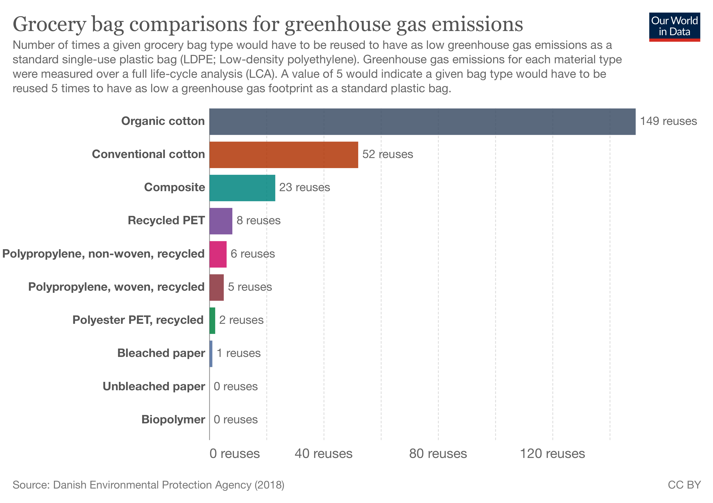
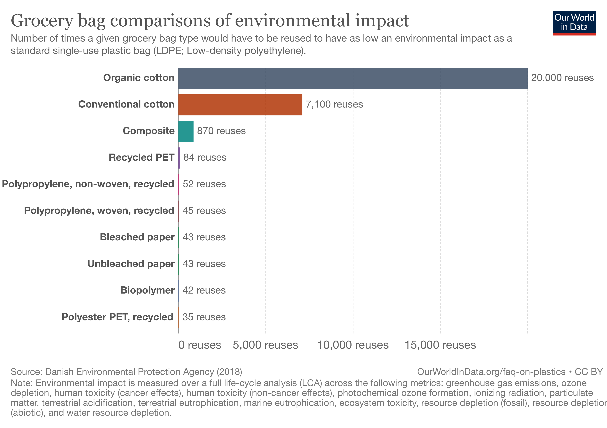

# ecoLogical?
Final project for the Building AI course

<!-- This is the markdown template for the final project of the Building AI course, 
created by Reaktor Innovations and University of Helsinki. 
Copy the template, paste it to your GitHub README and edit! -->

## Summary

Plastic or paper? Meat or veggies? Car or bus?
More and more people try to reduce an impact we as a humanity has on our planet by changing their lifestyles and prefering environment friendly options such as recycling, using less plastic, eating plant based meals or prefering public transportation. But are those solutions allways the best? Is it really better to use cotton bag for storing rice instead of plastic?  What if producing this cotton bag costs a lot more emissions? What if it uses a lot more water or you have to transport those bags at long distance?

We tend to look solely on a final product and do not realize the complex mechanisms behind it. But what if we have a tool which would show us the whole journey of a product from materials used, through fabrication and finally packaging and transport or an impact a sport activity or other hobbies have on our environment and suggest alternatives. 

An application ecoLogical? would use AI to guide us through our complex world and help reduce carbon emissions and other effects we have on our planet.

## Background

Imagine going to the grocery store to buy some apples. Immediately you face a decision whether to use a plastic bag or a cotton one newly produced by the store claiming it is an ecological option. But is it true? Should you choose it? 

Let’s take a look at those statistics from Our world in data of how many times do we need to reuse this cotton bag to have as low greenhouse gas emissions as a single-use plastic bag (https://ourworldindata.org/faq-on-plastics#are-plastic-alternatives-better-for-the-environment). It is almost 52 times, that sounds realistic but for combined environmental effect (using several criteria such as ozone depletion or water resource depletion, etc.) it is 7100 times! Would the cotton bag withstand this long? And what about reusing the plastic bag.

So is this really ecological? You may grab a plastic bag next time you go shopping but however plastics really tend to have less overall impact there are exceptions - marine pollution and its non-degradability. The non-degradability is a positive feature when we want to store our food for a longer time but problematic once the plastic gets in the ocean. Which material is the best depends on the metrics as well as on a purpose. In other words we are trying to make sense from a lot of data and AI is a perfect tool for such task.

As a millennial I notice a growing interest in my generation to adjust our everyday lives to be less harmful for the environment. A feature that would be even more pronounced in future generations, remember Fridays for future. But I would like to make decisions based on complex data processing instead of randomly follow greenwashed ads.

## How is it used?

For purpose of this project I sorted out our everyday life in categories:
   * Products 
      * Basically things we can buy with money that we are using (food, furniture, tools, books,…)
   * Activities 
      * Sports, hobbies, walking with your dog, watching TV
   * Travelling
      * Every transfer we make throughout a day
   * Housing
   * Job
      * Work place, company we work for and its impact on environment

To make it easier we will use carbon emissions produced at each activity as our criteria. The outcome should be an app which based on categories mentioned earlier would show us an impact our behavior has on carbon emissions and suggest better solutions. 
It should specifically show: 
   * A whole journey of a product from production to the moment we buy it in a shop.  Or what are the necessities for an activity we are doing
   * count carbon emissions this product or activity has
   * show alternatives

Educational purpose - seeing how complex could be a journey of a chocolate bar from chocolate beans to a shelf in our local shop could not only change some of our behaviors but inspire us to activelly seeking solutions with less impact on our planet and acknowledge power of AI for processing big amount of data.

## Data sources and AI methods
1st step - what activities, products etc. we would like to run through the app? We can either:

* Manually type items in

or

* Connect it with our online calendars, shopping list we save in our phones, bank account records to screen goods we bought, streaming time on TV

2nd step - acquire data to count carbon emissions or other metrics

  * There are product specifics, studies, information on energy balance of certain types of buildings or about carbon emissions produced by a car type we are driving. They are all over the internet, to browse them by ourselves would take too much time, but we can use AI to quickly gather the information (using for example 3 different reliable sources). Some data could be acquired directly from companies, willing to participate on the project.

3rd step - data processing
  * after collecting data the app would calculate an amount of carbon emissions (or other metrics) each item produces

4th step - suggestions
  * the app should be able to suggest alternatives for products or activities. It could give us a overall of our whole day showing the activities with biggest impact. We can use filters, tag activities we don’t want to change, browse different options.
  * This part would require reinforcement learning techniques, when the goal of the model would be to obtain the smallest amount of carbon emissions or other metrics (water requirements, etc.) 

## Challenges

False data from companies to make their products or activities look better in the app. 

Greenwashing - for example a company focusing its marketing on particular product standing well in app or even being recommended by it while producing other goods with significantly worse score.

A big chunk of different data (products details, energetic specifics about local gym, information about public transports in thousands of cities). The model could work better on some part of the data and poorly on another. In fact the amount would probably be overwhelming at the beginning and the app would have to start with fewer categories.

Security issues - a decent security system would be a non negotiable part of the app, because of the amount of data about our everyday lives

Using more criteria to measure our impact on the environment apart from carbon emissions, for example amount of water used, lesser waste production etc.

Cost - alternatives recommended by the app may not be financially available for everybody. 

## What next?

No matter how important is a behavior of a single person the biggest producers of carbon emissions are large companies. According to CDP reports (https://www.cdp.net/en/articles/media/new-report-shows-just-100-companies-are-source-of-over-70-of-emissions) 100 global companies produce 71 % of all carbon emissions in the world. This app should be an opening which would show people how complex an ecological behavior could be and give us a hint where to put pressure on companies. But a real impact would be making such app for those businesses, for their products, goods and services. 

The variation of the app for companies should include:
* Materials used
* Production process
* Buildings
* Packaging
* Trasportation
* Business partners
* And suggestions for optimization.

## Acknowledgments

Sources of inspiration:

Our world in data (https://ourworldindata.org 

Podcast “Za humny” (https://open.spotify.com/show/5ijP5ndQ4zzHoGXRFBtW16?si=274d862e0e474b47), especially episode 37

CDP reports (https://www.cdp.net/en/)

